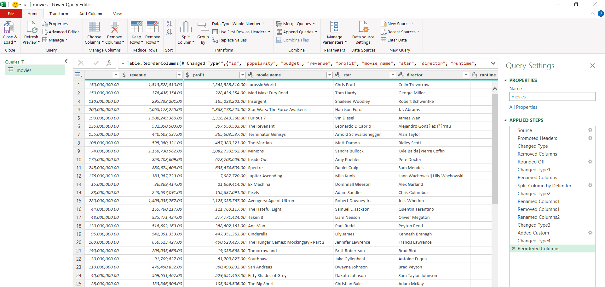

# 🎬 Movies Data Analysis Dashboard (Excel & Power Query)

## 📌 Overview
This project presents a complete movie dataset analysis using **Excel**, **Power Query**, and **Pivot Tables**, ending with a dashboard that shows key business and industry insights. The goal is to explore trends in movie revenue, profit, ratings, and genres.

---

## 🛠️ Tools Used
- Microsoft Excel
- Power Query
- Pivot Tables
- Excel Charts

---

## 🧹 Data Cleaning (Power Query)
The raw dataset was first cleaned using Power Query:
- Removed unnecessary columns
- Changed incorrect data types
- Added a calculated column  

📸 Power Query Steps Screenshot:  

---

## 📊 Dashboard Highlights
- Top 10 Most Popular Movies
- Top 10 Highest Grossing Movies
- Revenue, Budget, and Profit Comparison
- Top 10 Directors by Profit
- Most Frequent Stars
- Highest Rated Movies
- Movie Production by Year
- Profit vs Budget Over the Years
- Top Genres by Budget

📸 Dashboard:  

---

## ✅ Project Goals
- Clean and transform movie data using Power Query
- Perform data analysis using Pivot Tables
- Build a visual dashboard to present key findings

---

- 💼 [LinkedIn](www.linkedin.com/in/ahmed-abdelmoaty-2b6860357)
